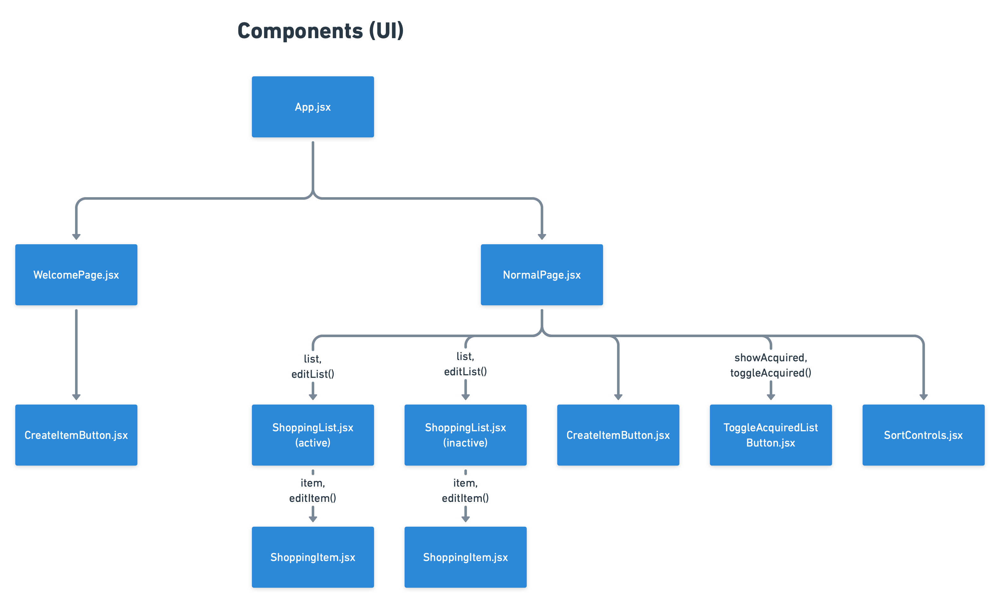
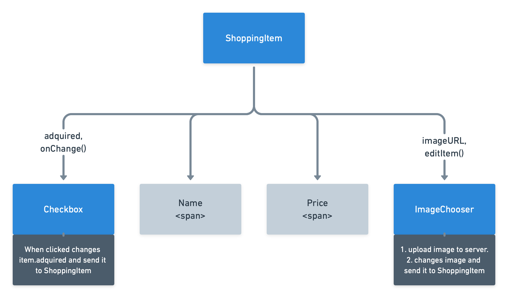

This project was bootstrapped with [Create React App](https://github.com/facebook/create-react-app).

# 1. EIKA Web Developer test

This is a simple todo list app to allow users to add items to their shopping list when they are inside the EIKA furniture stores.

The project is done with the latest version of React and uses functional components with Hooks for better modularity in case it needs to be expanded.

---

## 2. Setup

These are the instructions to run the project:

1. Open the terminal and navigate to the folder where this readme file is located.
1. Install the project dependencies by typing `npm install` on the terminal.
1. Start the project by typing `npm start` on the terminal.

---

## 3. Usage instructions

To get started press the Add new item button and a popup will ask you the name and the price of the item you want to add.

Once an item has been added, you can add a picture for it by pressing on the camera icon or mark it as complete by pressing on the checkbox.

---

## 4. Dependencies

Beside React JS and it's own dependencies, this project uses:

1. Recoil for global state management of the shopping list state.
1. Firebase Cloud Storage for uploading and hosting the images of each shopping item.

---

## 5. Project organization

### 5.1 Requirement gathering

The document submited by the fictional company as the coding test. It is highlighted using color to differenciate the functional, non-functional requrirements among other key elements.

[Google Docs link](https://docs.google.com/document/d/10yfSCWoImkXE1u_5DjaOkeubZGnESe8UnCqsPxNVwBk/edit?usp=sharing)

---

### 5.2 Project spreadsheet

A spreadsheet with the information related to the organization of the project.

[Google Spreadsheets link](https://docs.google.com/spreadsheets/d/1nLsgm8f0hRplUYWtjpeVqjqMKvUjlav3eh8a50drkHk/edit?usp=sharing)

---

### 5.3 User flows

A low detail diagram to visualize how the app will work.

The focus is to undertand what interactions like clicking buttons, filling forms, etc, in order to complete their objectives inside the app.

[Whinsical User Flow board](https://whimsical.com/shopping-list-Km3VRQ31QthCZPVwaqDmQ4@7YNFXnKbYokbr3nbEPesq)

---

### 5.4 Design mockup

A low detail mockup to visualize how the app will look.

The focus is on colors, fonts, branding and the positions of each element on the screen.

[Figma link](https://www.figma.com/file/wVTaT3Ckenki3nvACl0lCp/EIKA-Shopping-list?node-id=0%3A1)

---

### 5.5 Component tree

The component tree allows to visualize the overall hierarchy of the project.

The first diagram covers the overal application layout:

The second diagram covers the `ShoppingItem` component in detail.

## 6. Atribbutions

This project uses the following external art assets:

- EIKA logo: Modified from the IKEA website.
- Noto Sans: An open source font similar to the one IKEA uses.
- Icons: Font awesome 5.
